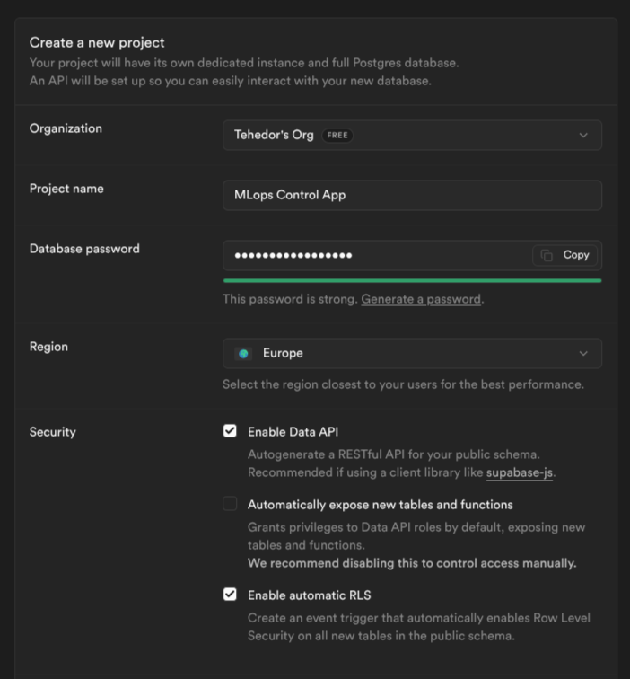
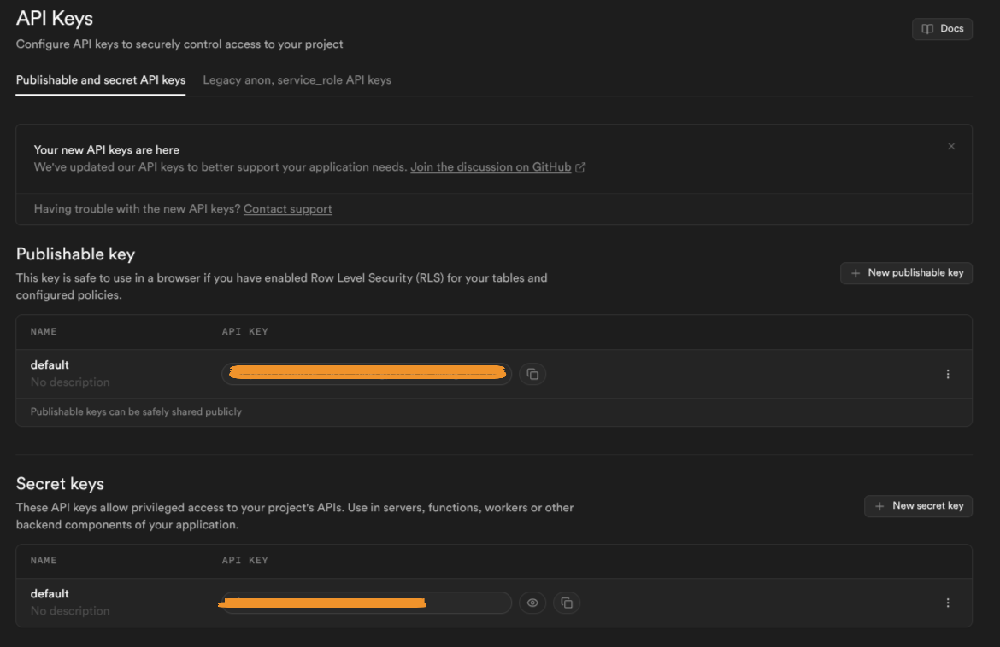
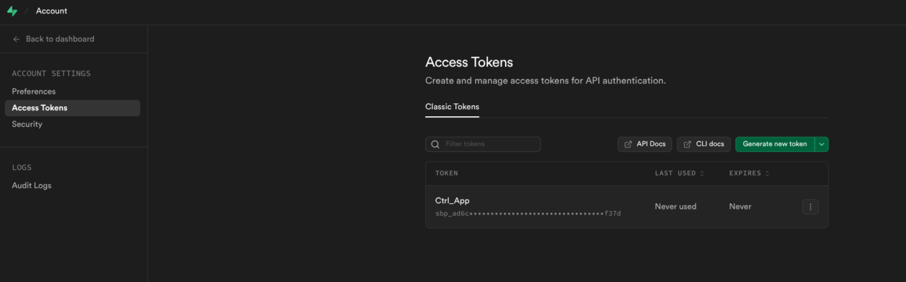

- [Supabase](#supabase)
- [Pasos](#pasos)
  - [1. Crear organización con plan gratuito](#1-crear-organización-con-plan-gratuito)
  - [2. Crear proyecto](#2-crear-proyecto)
    - [3. Credenciales y Claves de Acceso](#3-credenciales-y-claves-de-acceso)
  - [4. URL de supabase](#4-url-de-supabase)
  - [4.5. Access Token (Docker / CI)](#45-access-token-docker--ci)
  - [5. Crear tabla y estructura de los datos](#5-crear-tabla-y-estructura-de-los-datos)
  - [6. Políticas de RLS (Row Level Security).](#6-políticas-de-rls-row-level-security)
  - [7. Configurar el Webhook en GitHub](#7-configurar-el-webhook-en-github)
    - [6.1. Configuración de Seguridad y Mantenimiento (Supabase)](#61-configuración-de-seguridad-y-mantenimiento-supabase)
      - [6.1. Políticas de Row Level Security (RLS)](#61-políticas-de-row-level-security-rls)
      - [6.2. Automatización de Limpieza de Logs (Trigger)](#62-automatización-de-limpieza-de-logs-trigger)

# Supabase
[url](https://supabase.com/)


# Pasos
## 1. Crear organización con plan gratuito
## 2. Crear proyecto



### 3. Credenciales y Claves de Acceso
> Poryect settings -> Api Keys



- Publishable key (Client / Frontend Key):
Destino: backend/.env o frontend/.env. - SUPABASE_PUBLISHABLE_KEY

    + Uso: Se utiliza en la aplicación de control (lado del cliente). Esta clave es pública por diseño. Solo permite realizar operaciones que estén autorizadas por las políticas de RLS (Row Level Security) que hayamos definido en las tablas. Es segura de incluir en el código del navegador o apps distribuidas.

- Secret key (Service Role Key):
Destino: `backend/.env` → `SERVICE_ROLE_KEY` **y** GitHub Secrets → `SUPABASE_SECRET_KEY`.

    + Uso: Clave de administrador. La Edge Function de Supabase la necesita para poder escribir en las tablas (upsert de `workflow_runs` e insert de `workflow_logs`) saltándose RLS. También se usa en GitHub Actions para operaciones privilegiadas.

    >⚠️ ADVERTENCIA: Nunca debe incluirse en el código del cliente ni exponerse públicamente. El fichero `backend/.env` está en `.gitignore` — nunca lo subas al repositorio.

    **Cómo añadirla al proyecto:**
    ```env
    # backend/.env
    SERVICE_ROLE_KEY=eyJ...tu_service_role_key_aqui...
    ```
    El script `make supabase-deploy` / `make supabase-redeploy` la lee automáticamente y la sube como secret de la Edge Function.

## 4. URL de supabase
> Project settings → API → **Project URL**

⚠️ **No uses** la URL de "Data API" (`...supabase.co/rest/v1/`).
Copia solo la URL base del proyecto: `https://<proyecto>.supabase.co`

El SDK añade `/rest/v1` internamente. Si pegas la URL del Data API endpoint
obtendrás rutas duplicadas (`/rest/v1/rest/v1/...`) y errores 404.

- Ctrl App
Proyect → backend/.env → `SUPABASE_URL=https://<proyecto>.supabase.co`

- Github
Para que tus GitHub Actions sepan a dónde enviar los logs, debes guardarla como un secreto del repositorio:

a. Ve a tu repositorio en GitHub.

b. Haz clic en Settings (la pestaña superior del repo).

c. En el menú lateral izquierdo, busca Secrets and variables > Actions.

d. Haz clic en el botón verde New repository secret.

e. Crea un secreto llamado SUPABASE_URL y pega la URL que copiaste.

## 4.5. Access Token (Docker / CI)
> supabase.com → Account → Access Tokens

Necesario para autenticar el CLI de Supabase **sin login interactivo** (entornos Docker, CI/CD o cualquier servidor sin navegador).



- **Tipo:** Token de gestión de cuenta (no es la API key del proyecto).
- **Permisos:** acceso a todos tus proyectos Supabase.

> ⚠️ **ADVERTENCIA:** Trátalo como una contraseña. Nunca lo expongas públicamente ni lo subas al repositorio.

**Pasos:**

a. Inicia sesión en [supabase.com](https://supabase.com).

b. Haz clic en tu avatar (esquina superior derecha) → **Account**.

c. En el menú lateral: **Access Tokens** → **Generate new token**.

d. Dale un nombre descriptivo (p.ej. `mlops-dashboard-docker`) y copia el token.

e. Añádelo a `backend/.env`:

```env
SUPABASE_ACCESS_TOKEN=sbp_xxxxxxxxxxxxxxxxxxxxxxxxxxxxxxxxxxxx
```

Con esta variable definida, `make dev` (o `make supabase-deploy`) desplegará la Edge Function automáticamente sin necesidad de `supabase login`.

---

## 5. Crear tabla y estructura de los datos

Ver modelo de datos en `.agent/30_Servicio3_logsRunners.md`.

## 6. Políticas de RLS (Row Level Security).

### 6.1. Configuración de Seguridad y Mantenimiento (Supabase)

Para finalizar la configuración de la base de datos, es necesario establecer las políticas de acceso público de lectura (RLS) y automatizar la limpieza de registros para no exceder el límite de almacenamiento de la capa gratuita (500 MB).

Dirigirse a **SQL Editor** en el panel de Supabase y ejecutar los siguientes scripts:

#### 6.1. Políticas de Row Level Security (RLS)
Habilita la lectura de datos para las aplicaciones cliente que utilizan la `Publishable key` (anon), manteniendo bloqueada la escritura pública.


#### 6.2. Automatización de Limpieza de Logs (Trigger)
Implementa una rutina automática que elimina los registros con más de 7 días de antigüedad cada vez que se inserta un nuevo log.

> **Nota:** El intervalo `'7 days'` puede ajustarse según el volumen de operaciones y los requisitos de auditoría del proyecto.

Y apretamos en `run`

Todo para copiar y pegar:
```sql
--------------------------------------------------------
-- 1. CREACIÓN DE TABLAS (Alineado con GitHub Actions)
--------------------------------------------------------

-- Tabla para los estados de las ejecuciones (Usando el run_id de GitHub como PK)
CREATE TABLE workflow_runs (
  run_id bigint PRIMARY KEY,
  repo text NOT NULL,
  branch text,
  workflow_name text,
  fase text,
  variant text,
  status text NOT NULL DEFAULT 'queued',
  conclusion text,
  created_at timestamp with time zone DEFAULT now(),
  updated_at timestamp with time zone DEFAULT now()
);

-- Tabla para los logs masivos (Enlazada al run_id de GitHub)
CREATE TABLE workflow_logs (
  id uuid PRIMARY KEY DEFAULT gen_random_uuid(),
  run_id bigint NOT NULL REFERENCES workflow_runs(run_id) ON DELETE CASCADE,
  step_name text,
  line_no int,
  content text NOT NULL,
  ts timestamp with time zone DEFAULT now()
);

-- Índice para acelerar la lectura de logs en el frontend
CREATE INDEX ON workflow_logs(run_id, line_no);


--------------------------------------------------------
-- 2. POLÍTICAS DE SEGURIDAD (RLS)
--------------------------------------------------------
-- Activar el escudo RLS
ALTER TABLE workflow_runs ENABLE ROW LEVEL SECURITY;
ALTER TABLE workflow_logs ENABLE ROW LEVEL SECURITY;

-- Permitir a las aplicaciones cliente (anon) lectura de estados
CREATE POLICY "Allow client read access for runs"
ON workflow_runs FOR SELECT
TO anon
USING (true);

-- Permitir a las aplicaciones cliente (anon) lectura de logs
CREATE POLICY "Allow client read access for logs"
ON workflow_logs FOR SELECT
TO anon
USING (true);

-- GRANT de privilegios al rol anon (lectura desde el frontend)
-- Sin esto, PostgreSQL bloquea el acceso aunque exista la policy RLS.
GRANT SELECT ON workflow_runs TO anon;
GRANT SELECT ON workflow_logs TO anon;

-- GRANT de privilegios al rol service_role (escritura desde la Edge Function)
-- La Edge Function usa la Secret key que mapea al rol service_role.
-- Sin esto, el upsert desde la Edge Function falla con "permission denied".
GRANT ALL ON workflow_runs TO service_role;
GRANT ALL ON workflow_logs TO service_role;


--------------------------------------------------------
-- 3. ACTIVAR REALTIME (TIEMPO REAL)
--------------------------------------------------------
-- Añade las tablas al canal de publicación para que los 
-- clientes reciban los eventos en directo vía WebSockets.

ALTER PUBLICATION supabase_realtime ADD TABLE workflow_runs;
ALTER PUBLICATION supabase_realtime ADD TABLE workflow_logs;


--------------------------------------------------------
-- 4. AUTOMATIZACIÓN DE LIMPIEZA DE LOGS (TRIGGER)
--------------------------------------------------------
-- Implementa una rutina automática que elimina los registros con 
-- más de 7 días de antigüedad para proteger el Free Tier de 500MB.

-- 4.1 Crear función de eliminación basada en antigüedad
CREATE OR REPLACE FUNCTION clean_old_logs()
RETURNS TRIGGER AS $$
BEGIN
  DELETE FROM workflow_logs WHERE ts < NOW() - INTERVAL '7 days';
  DELETE FROM workflow_runs
    WHERE updated_at < NOW() - INTERVAL '30 days'
      AND conclusion IS NOT NULL;
  RETURN NULL;  -- requerido para triggers FOR EACH STATEMENT
END;
$$ LANGUAGE plpgsql;

-- 4.2 Asociar la función a un trigger de inserción en la tabla de logs
-- FOR EACH STATEMENT: se dispara una vez por sentencia INSERT, no por fila.
CREATE TRIGGER trigger_clean_old_logs
AFTER INSERT ON workflow_logs
FOR EACH STATEMENT EXECUTE FUNCTION clean_old_logs();
```
---
+ Para eliminar
```sql
  DROP TABLE IF EXISTS          
  workflow_logs;                  
  DROP TABLE IF EXISTS
  workflow_runs;                  
                  
```

---

## 7. Configurar el Webhook en GitHub
> Repositorio MLOps_actions_v2 → Settings → Webhooks → Add webhook

Una vez desplegada la Edge Function (`make supabase-deploy`), hay que decirle a GitHub que envíe los eventos de workflow a esa URL.


**Pasos:**

a. Ve al repositorio en GitHub: `github.com/<OWNER>/<REPO>`.

b. Haz clic en **Settings** (pestaña superior del repo).

c. En el menú lateral izquierdo: **Webhooks** → **Add webhook**.

d. Rellena el formulario:

| Campo | Valor |
|-------|-------|
| **Payload URL** | `https://<SUPABASE_PROJECT_REF>.supabase.co/functions/v1/github-webhook` |
| **Content type** | `application/json` |
| **Secret** | El valor de `WEBHOOK_SECRET` de tu `backend/.env` (déjalo vacío si no lo configuraste) |
| **Which events?** | Selecciona **"Let me select individual events"** → marca solo **Workflow runs** |
| **Active** | ✅ marcado |

> `<SUPABASE_PROJECT_REF>` es la parte inicial de tu `SUPABASE_URL` (p.ej. si tu URL es `https://abcdef.supabase.co`, el ref es `abcdef`). El script `make supabase-deploy` imprime la URL completa al finalizar.

e. Haz clic en **Add webhook**.

GitHub enviará un evento `ping` de prueba. Si la Edge Function responde `200 OK`, el webhook está activo.

**Verificar que funciona:**

a. En la página del webhook recién creado, desplázate hasta **Recent Deliveries**.

b. Deberías ver el evento `ping` con un tick verde ✓.

c. Lanza cualquier workflow en el repositorio desde GitHub Actions.

d. En **Recent Deliveries** aparecerán los eventos `workflow_run` con acción `requested` → `in_progress` → `completed`.

e. En el dashboard (vista **GH Actions**) el run debería aparecer en segundos.

> **Si aparece un error 401 en Recent Deliveries:** el `WEBHOOK_SECRET` del formulario no coincide con el configurado en la Edge Function. Ejecuta `make supabase-redeploy` tras corregir el valor en `backend/.env`.